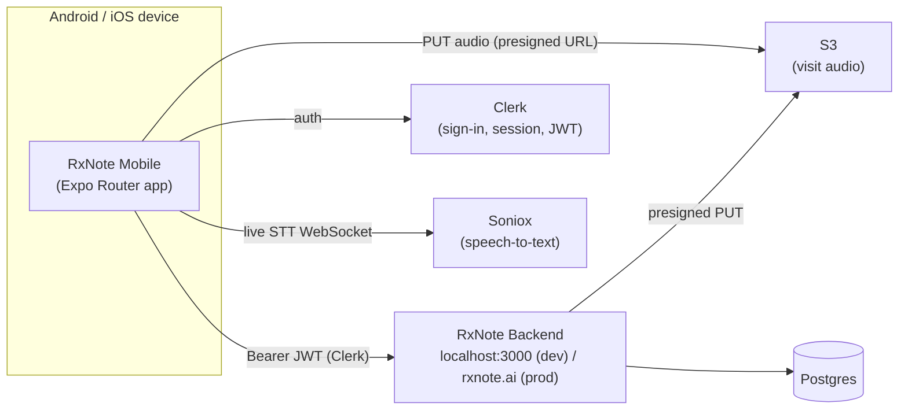
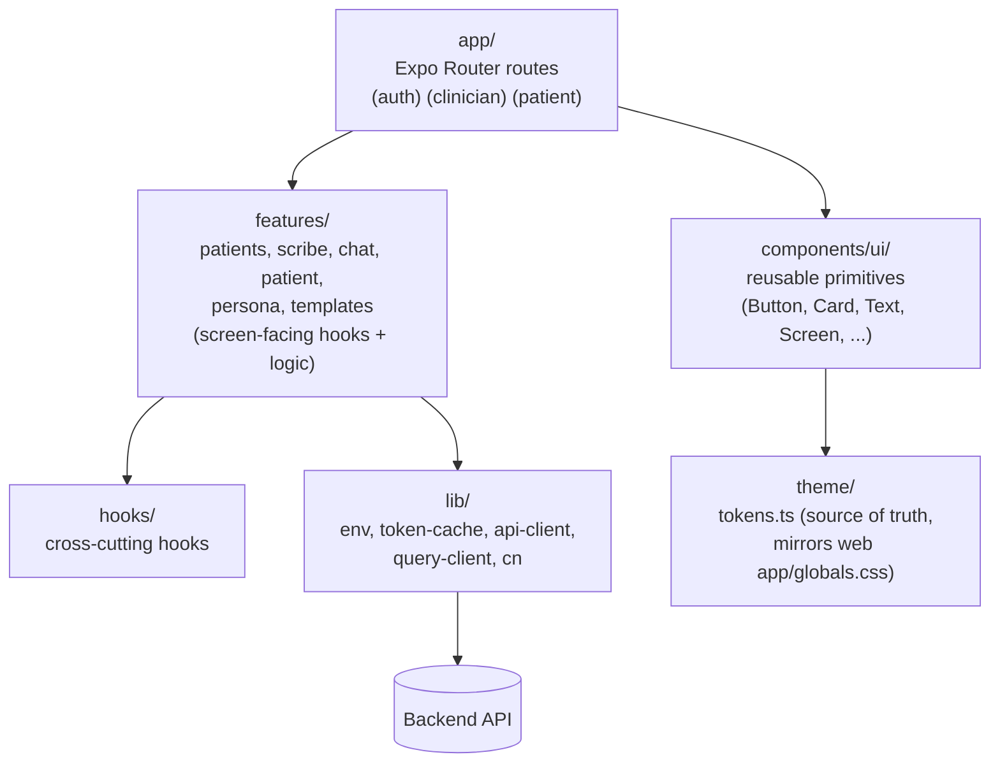
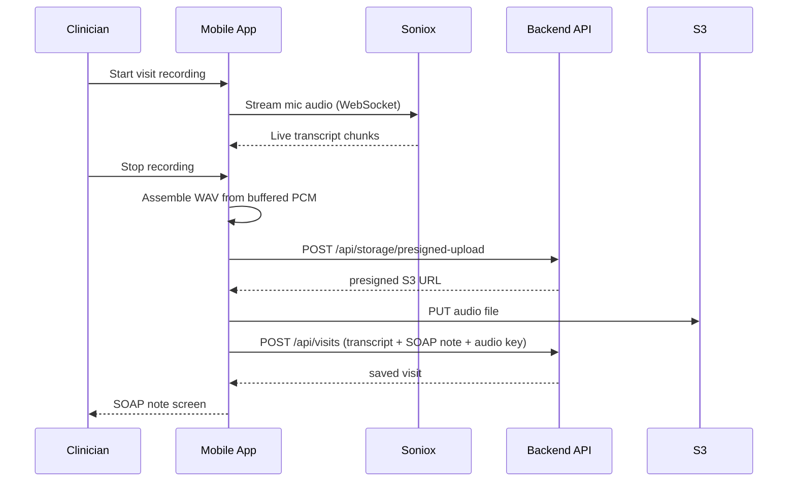
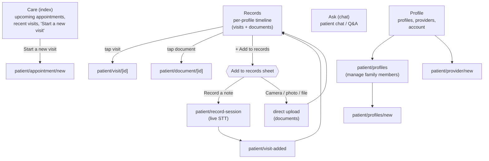
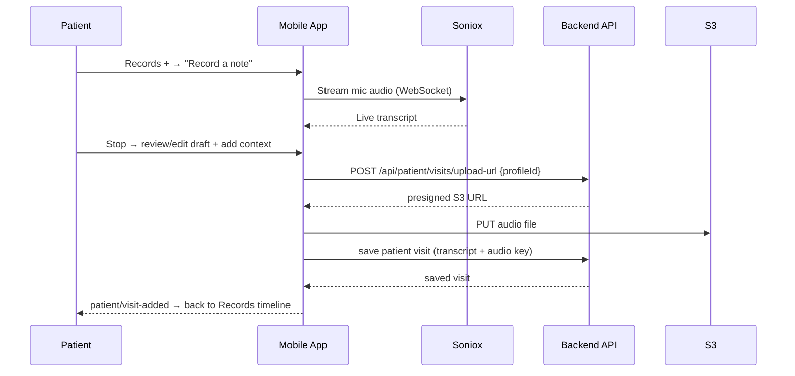

# RxNote Mobile

Expo SDK 57 · React 19 · RN 0.86 · Expo Router · TypeScript · NativeWind v4 · Clerk.

Clinician/patient mobile app for RxNote, isolated from the web app (own `node_modules` +
`package-lock.json`, npm — do not add to the root pnpm workspace). See `AGENTS.md` for the
full agent/contributor guide and `../../docs/MOBILE_APP_PLAN.md` for the project plan.

## Architecture

### System



Auth (Clerk) and speech-to-text (Soniox) are called directly from the device; everything
else — patients, visits, SOAP note generation, presigned upload URLs — goes through the
RxNote backend API.

### App layers (`src/`)



Screens under `src/app/` stay thin — routing and layout only. Data fetching and business
logic live in `src/features/*` and `src/hooks/`, built on the shared `useApiClient` /
`query-client` in `src/lib/`. Visual styling goes through NativeWind classes backed by
`src/theme/tokens.ts`, never inline color literals.

### Recording → note flow



### Patient flow (`(patient)` route group)

Bottom tabs are **Care** (`index`) / **Records** / **Ask** (`chat`) / **Profile**. `record` and
`documents` are routable but not tabs — reached from inside Records (`AddRecordSheet`, the
Records `+`) or a Care shortcut.



Recording a note (self-service, patient-initiated) mirrors the clinician recording flow but
saves against a **profile** (self or a family member) instead of a clinician's patient:



## Setup

```bash
npm install
cp .env.example .env   # set EXPO_PUBLIC_CLERK_PUBLISHABLE_KEY + EXPO_PUBLIC_API_BASE_URL
```

## Pointing the app at a backend

`EXPO_PUBLIC_API_BASE_URL` is inlined into the JS bundle at bundle time, so **restart Metro**
(`--clear`) after changing it. `scripts/set-env.js` writes `.env` for you:

```bash
node ./scripts/set-env.js prod    # https://rxnote.ai (production Clerk instance)
node ./scripts/set-env.js local   # http://localhost:3000
node ./scripts/set-env.js lan     # http://<this-mac-lan-ip>:3000
```

| Target device                                   | Use            | Notes                                                                 |
| ------------------------------------------------ | -------------- | ---------------------------------------------------------------------- |
| Android emulator                                 | `local`        | Emulator and Mac share loopback over adb; needs `adb reverse` (below). |
| Physical device, USB, same Wi-Fi as Mac          | `lan`          | No adb needed — device hits the Mac's LAN IP directly.                |
| Physical device, USB, **different** Wi-Fi/subnet | `local`        | `lan` can't route between subnets; use `adb reverse` instead.         |
| Production backend                               | `prod`         | No local backend or port forwarding needed.                           |

`local` requires the device (real or emulated) to reach the Mac's `localhost`. Do this once
per device connection (drops on USB re-enumeration or emulator restart):

```bash
adb devices -l                 # confirm the target's serial, e.g. emulator-5554
adb -s <serial> reverse tcp:3000 tcp:3000   # backend
adb -s <serial> reverse tcp:8081 tcp:8081   # Metro bundler
```

Corresponding npm shortcuts also exist and chain the env switch with the native build:
`env:prod` / `env:local`, `start:prod` / `start:local`, `android:prod` / `android:local`,
`ios:prod` / `ios:local`.

## Running on a device or emulator

```bash
npx expo start                 # dev server only (for an already-installed dev client)
npx expo run:android           # build + install + launch on Android
npx expo run:ios               # build + install + launch on iOS (simulator build currently
                                # broken on SDK 57, see AGENTS.md/SESSION_HANDOFF.md — device works)
```

If more than one Android device/emulator is attached, `expo run:android`'s `--device` flag
wants a device *name*, not the adb serial, which usually doesn't match. Target a specific
device with `ANDROID_SERIAL` instead:

```bash
adb devices -l                          # list attached devices/emulators
ANDROID_SERIAL=<serial> npx expo run:android
```

To launch an emulator that isn't already running:

```bash
emulator -list-avds                     # e.g. Pixel_9_Pro, Pixel_Tablet, Pixel_3a_API_34
~/Library/Android/sdk/emulator/emulator -avd <name> &
```

Once it's running, set up `adb reverse` for it (see table above) before starting/reloading
the app so it can reach a `local` backend.

To reload an already-installed build without rebuilding:

```bash
adb shell am force-stop com.medicalrxnote.mobile
adb shell monkey -p com.medicalrxnote.mobile -c android.intent.category.LAUNCHER 1
```

## Other useful commands

```bash
npx tsc --noEmit                                       # typecheck
npx expo lint                                           # lint
npx expo-doctor                                          # config/dependency health
npx expo export --platform ios --output-dir /tmp/x       # verify the app bundles
```

## Learn more

- [Expo documentation](https://docs.expo.dev/versions/v57.0.0/) — this project pins SDK 57;
  use the versioned docs (or the Expo MCP) for API references.
- [Expo Router](https://docs.expo.dev/router/introduction)
